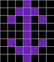
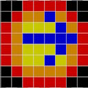
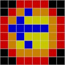
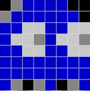
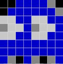

# Pixelamp_Ext
Code Arduino pour la lampe Pixel créée par Heliox et par un inconnu dont je laisse le commentaire plus bas.
Attention : n'utiliser <b>QUE</b> les versions tagguées, les autres sont en cours de développement et peuvent ne pas fonctionner.

## Version (Utiliser les Tags)
- **1.0** : Première version utilisant le nouveau moteur et les modes (Pacman / Fx / Lumières / etc).
- **2.0** : Version permettant d'éviter les soudures et la colle chaude pour monter le ruban.
  - Possibilité de plier le rubant en ignorant une led en haut et en bas (non éclairée et pas dans une case de la lampe).
  Ceci permet d'éviter de couper puis souder le rubant (très long à faire), très complexe a mettre dans la lampe et provoque des cassures, des faux contacts.
  En pliant rubant en haut et en bas, on évite ces soudures et les faux contacts mais il faut laisser une led non utilisée à chaque fois pour que la led suivante soit correctement au milieu de la case.
  Bref, après un échec pour finir la lampe, j'ai commandé un nouveau ruban et j'ai modifié le code pour faire un nouvel essai.
  - Projet Fusion 360 + STL de clips permettant de clipser le ruban dans les cases de pixels sans être obligé de les coller à la colle chaude.
  - Ajout d'un mode Aléatoire qui change automatiquement toutes les x secondes (réglage par le potentiomètre du haut).
  - Correction de problèmes de lecture des pin analogiques, certainement dûe à une alimentation pas très stable.

## Généralités
Le code original est disponible [ici](https://drive.google.com/file/d/1V1oVRu5Qm_7Lyr85kFy6UF3OYe4PQe78/view).
Le code fourni par Heliox permet de générer des animations et de jolis effets.
Toutefois, j'ai voulu aller plus loin et proposer quelques trucs en plus. Le but étant d'avoir à minima ce qui était proposé par le code original.

Mais si on ajoute beaucoup de choses différentes, le potentiomètre de choix des animations devient limité. J'ai donc choisi de définir des modes.
Dans chaque mode on a tous les effets du mode en question (Pacman / Fire / etc...).

J'ai ajouté du texte défilant pour chaque mode.

Afin de développer sans avoir l'Arduino, j'ai écris un simulateur de la lampe. C'est pas super propre, et tous les fonctionalités de FastLed ne fonctioneront
certainement pas mais c'est bien pratique de tester sans l'Arduino.

## Changement de mode d'affichage (Pacman / Feux / Fx / Lumières / Aléatoire)
Comme il n'est pas question d'ajouter des boutons, j'ai utilisé ceux existants, à savoir le bouton de choix de la luminosité : 
droite / gauche / droite pour aller au mode suivant.
gauche / droite / gauche pour aller au mode précédent.

## Mode setup
Un setup permet de définir quelques réglages, il est accessible par le changement rapide du bouton de luminosité : gauche / droite / gauche / droite / gauche (ou l'inverse) pour aller au mode Setup, idem pour en ressortir.
Dans ce mode la luminosité est bloquée, le bouton de lumière permet de sélectionner la valeur, le potentiomère des animations permet de sélectionner quel réglage est à modifier.
Il suffit de bouger la luminosité et le réglage s'active.
Après 4 secondes il est bloqué et clignote pendant 4 secondes avant son enregistrement. Si le bouton de luminosité est utilisé pendant ce laps de temps (pendant que le réglage clignote) le
réglage est abandoné et retourne à sa position initiale sinon il est sauvegardé.
Après encore 4 secondes, il retourne a l'affichage des valeurs enregistrées.

<ins><b>Les réglages sont les suivants :</b></ins>
- Définir le centre de la lampe (à régler au dessus du bouton de réglage de lumière) afin que les animations de texte et réglages soient centrées et correctement visibles.
  Comme la version d'Heliox les animations n'avaient pas de centre il est possible de coller le ruban de led n'importe où (pas besoin de centrer la rangée 8 au centre du bouton de luminosité), or dans cette version la lampe affiche des messages et si ces messages ne sont pas centrés ça ne sera pas lisible (idem pour le Pacman lorsque le fantôme rentre dans sa maison), il est donc important de faire ce réglage. 
  - <ins>Image de sélection du centre de la lampe, à positionner de préférence en face du bouton de luminosité :</ins> 
     
- Inversion du potentiomètre de choix de la luminosité (si mal câblé, permet de corriger logiciellement).
  - <ins>Mode normal :</ins> 
     
  - <ins>Mode inversé :</ins> 
     
- Inversion du potentiomètre de choix de l'animation (si mal câblé, permet de corriger logiciellement).
  - <ins>Mode normal :</ins> 
     
  - <ins>Mode inversé :</ins> 
     

Ces choix sont conservés dans l'EEPROM de l'Arduino.

## Mode aléatoire
La liste des animations aléatoires est initialisée dans le code <i>pixelampext.ino</i>.
Dans ce mode, le potentiomètre de modification des animations n'est plus utilisé de la même manière puisque c'est le programme qui choisi aléatoirement les animations. Il est donc utilisé afin de sélectionner la durée de chaque animation. 

# Code
Les commentaires du code sont écris en anglais. J'ai utilisé des classes que j'avais développé auparavant.
- surveillance des fuites mémoires en mode simulation (il reste 3 memory leaks au moment où j'écris ces lignes, je ne trouve pas pour le moment).
- Tous les sprites sont écris en mémoire programme, ceci a l'avantage de ne pas prendre sur la mémoire vive qui est limitée. De plus les couleurs sont stockées sur un seul octet pour une
  optimisation de la mémoire et les couleurs sont mises lors du chargement du sprite (dans le code).
- Des pointeurs partagés sont utilisés afin d'éviter les fuites mémoire.

## Compilation
Visual Studio est utilisé ainsi que le plugin vMicro (version démo qui ne dure qu'un temps) qui me permet d'accéder à l'Arduino Méga.

## Constantes à modifier dans le code avant téléversement dans l'Arduino
Un certain nombre de constantes et de définitions permettent de modifier le comportement du programme. 
Le cablâge et les modifications apportées sont expliqués plus en détails dans la documentation suivante : [Réalisation de la lampe pixel d'Heliox](make/README.md) 
- Mode aléatoire (<i>animationrandom.cpp</i>) : 
Le potentiomètre de choix des animations est utilisé afin de sélectionner la durée de chaque animation. Cette durée est configurable entre <b>RANDOM_MIN_TIME</b> et <b>RANDOM_MAX_TIME</b>.
Ces valeurs sont actuellement renseignées avec les valeurs suivantes : 
  - <b>RANDOM_MIN_TIME</b> = 10  (10 secondes)
  - <b>RANDOM_MAX_TIME</b> = 600 (10 minutes)
- Type de câblage (<i>enginedefines.h</i>) : 
La configuration par défaut définie sur le câblage normal du projet d'Heliox. Or ce câblage est très complexe à réaliser : environ 90 soudures sur le ruban de leds, des soudures qui risquent de se casser et de faire des faux contacts, du collage à la colle chaude des rubans qui n'est pas du plus facile à faire (on se brule, on casse les soudures, ça se décolle, bref une galère). 
Les constantes a définir sont les suivantes : 
  - <b>NO_SOLDERINGLED</b> : Activer pour passer en mode sans soudure.   
  - <b>NO_SOLDERING_FIRST_LED_IS_NOT_USED</b> : Ignorer la première LED, c'est la deuxième qui est dans la première case de la lampe. N'est actif que si <b>NO_SOLDERING_LED</b> est activé.
  - <b>NO_SOLDERING_LAST_LED_DOES_NOT_EXIST</b> : Ignorer la dernière LED, après la dernière LED, une led supplémentaire est laissée. N'est actif que si <b>NO_SOLDERING_LED</b> est activé.
- Luminosité maximale (<i>enginedefines.h</i>) : 
  - <b>MAX_BRIGHTNESS</b> : Mettre 255 si l'alimentation peut fournir au moins 8A, pour la lampe d'Heliox (4A max) laisser la valeur par défaut (150).

## Modifications réalisées pour la réalisation de la lampe Pixel d'Heliox
Un certain nombre de modifications ont été réalisées afin de rentre la construction de la lampe plus simple. L'alimentation 5V a été revue, de base l'alimentation 4A ne permettant pas d'allumer la lampe en blanc avec 100% de luminosité.
Les explications sont disponibles dans la documentation suivante : [Réalisation de la lampe pixel d'Heliox](make/README.md)

## Commentaires originaux
Les commentaires originaux ne sont plus complètement d'actualité. Par respect du travail effectué qui m'a servi de base et qui, pour pas mal de parties, est encore présent dans mon code,
je laisse les commentaires du développeur qui a créé ces superbes animations : [voir ici](ORIGINAL_README.md).
