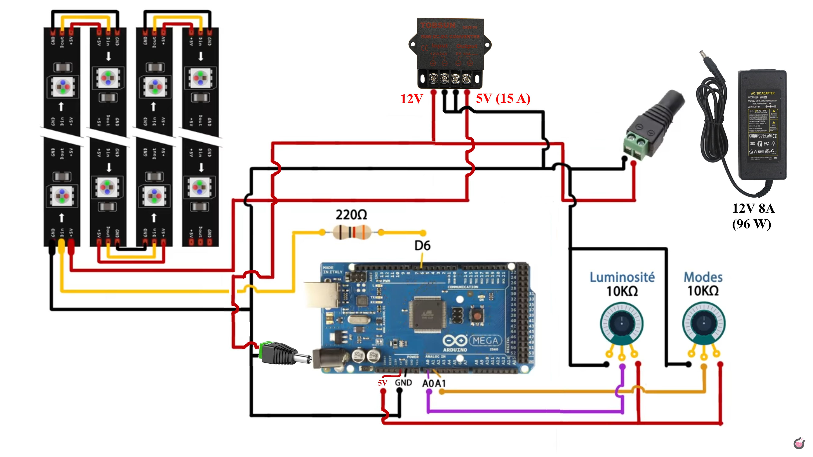

# Création de la lampe
Ci dessous les modifications apportées sur le projet de lampe Pixel d'Heliox.

## Matériel
- [Ruban Led adressable individuel blanc 5m 30Pixels/m (23.99€)](https://www.amazon.fr/gp/product/B088FJF9XF/ref=ppx_yo_dt_b_asin_title_o01_s00?ie=UTF8&psc=1)
- [JOYLIT Alimentation 12V 8A (21.99€)](https://www.amazon.fr/gp/product/B06ZXW91J7/ref=ppx_yo_dt_b_asin_title_o03_s01?ie=UTF8&psc=1)
- [Prototype PCB pour Arduino UNO R3 (5.99€)](https://www.amazon.fr/gp/product/B01FTVTJT2/ref=ppx_yo_dt_b_asin_title_o03_s01?ie=UTF8&psc=1)
- [Régulateur basse tension de Voiture (12V/24V à 5V 15A)(13.99€)](https://www.amazon.fr/gp/product/B09PTPFYC7/ref=ppx_yo_dt_b_asin_title_o03_s02?ie=UTF8&psc=1)

## Alimentation

### Puissance nécessaire
L'alimentation 4 A n'est pas suffisante pour allumer en blanc les 128 leds de la lampe. Le ruban composé de 150 leds est donné pour 45 W soit 45 / 150 = 0,3 W par led. 
Chaque led consomme donc 0,3 W et il y a 128 led dans la lampe soit 0,3 x 128 = 38,4 W sous 5 V soit 38,4 / 5 = 7.68 A. C'est presque le double de 4 A.
L'alimentation de 4 A n'est donc pas suffisante. C'est certainement pour cette raison que la luminosité est bridée à 150 (ou pour que les couleurs ne bavent pas d'une case à l'autre). 

### Arduino, modification du schéma
<ins><b>Le schéma original de Héliox est le suivant :</b></ins> 
 
 
Il présente un problème (voir explication [ici](https://www.locoduino.org/spip.php?article16)), en effet l'Arduino a un système de régulation de tension qui doit être correctement utilisé. 
Il est indiqué : <i>VIN ou RAW correspondent à l’entrée du régulateur de tension présent sur la carte. Pour alimenter l’Arduino via cette broche, il faut une alimentation dont la tension est comprise entre 7 et 12 V</i>. 
Or VIN est branché sur le 5 V, normalement l'Arduino ne devrait même pas démarrer; il faut donc brancher le VIN sur le 12 V, on va d'ailleurs utiliser le connecteur fait pour ça, celui sous l'entrée USB qui sert à le programmer. 
 
<ins><b>Nouveau schéma :</b></ins> 
 
Avec ce montage, l'Arduino est alimenté en 12 V par le bloc d'alimentation, c'est donc l'Arduino qui va réguler le 5 V pour la gestion des potentiomètres.
En sortie du convertisseur 12 V -> 5 V, seules les leds sont branchées, rien ne va sur l'Arduino et c'est normal. 
Les 2 potentiomètres sont gérés par le 5 V en sortie de la tension régulée de l'Arduino (PIN 5 V) avec que ses références +5 V soit correctes. 
Le GND peut-être pris sur la pin GND de l'Arduino ou directement à partir de l'alimentation, de toute façon toutes les masses sont interconnectées (le GND de l'Arduino est relié au GND de son alimentation VIN).
Les masses +12 V (-) et +5 V (-) doivent être reliées ! <b>(attention, ne pas relier les (+), il s'agit bien des deux masses des +12 V et +5 V)</b>.

<ins><b>Attention :</b></ins> 
Les leds sont directement alimentées par le convertisseur 12 V -> 5 V qui est capable de fournir 10 A, ce qui est large par rapport à ce qui est demandé par les 128 leds. Attention à ne pas brancher les leds sur la sortie +5 V de l'arduino, celui-ci ne pourrait pas fournir les 8 A nécessaires et pourrait être déterioré.
Ne pas relier le +5 V de l'Arduino au + 5 V du convertisseur 12 V -> 5 V non plus.

<ins><b>Puissance supplémentaire :</b></ins> 
Le code a été modifié afin de permettre de ne pas couper le ruban led et d'être obligé de réaliser près de 90 (16 x 6) soudures. Ceci est réalisé en perdant une led par rangée qui n'est jamais allumée. Il y a donc 16 rangées qui peuvent contenir une led supplémentaire (+ 1 led encore supplémentaire si avant le ruban on laisse une led et après la dernière led on laisse aussi une led, ceci est configurable dans le code du programme). 
Il y a donc dans le pire des cas : 16 (colonnes) * (8 lignes + 1 led supplémentaire) + 1 led supplémentaire (si 1ère + dernière) soit  16 * 9 + 1 = 145 leds. 
Il y a donc 145 * 0,3 W = 43,5 W (sous 5 A) soit 43,5/5 = 8,7 A, la puissance fournie (10 A) est donc suffisante dans le pire des cas. 
 
Actuellement, les leds supplémentaires restent noires mais dans l'avenir, peut-être que des évolutions pourront permettre de les allumer (par exemple pour éclairer le bouton du haut (choix des animations) et alimenter en lumière ce bouton s'il est imprimé en matière phosphorescente).
