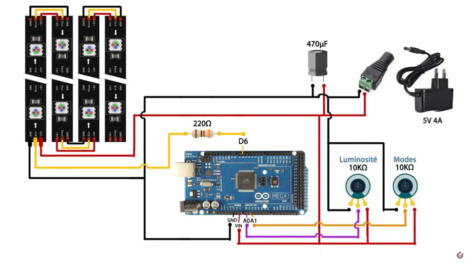
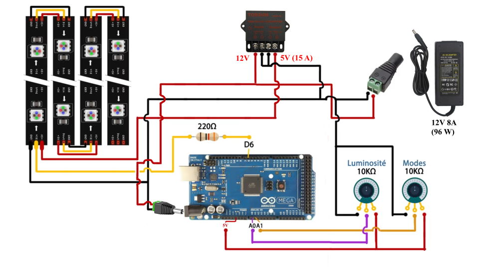

# Création de la lampe
Ci dessous les modifications apportées sur le projet de lampe Pixel d'Heliox.

## Matériel
- [Ruban Led adressable individuel blanc 5m 30Pixels/m (23.99€)](https://www.amazon.fr/gp/product/B088FJF9XF/ref=ppx_yo_dt_b_asin_title_o01_s00?ie=UTF8&psc=1)
- [JOYLIT Alimentation 12V 8A (21.99€)](https://www.amazon.fr/gp/product/B06ZXW91J7/ref=ppx_yo_dt_b_asin_title_o03_s01?ie=UTF8&psc=1)
- [Prototype PCB pour Arduino UNO R3 (5.99€)](https://www.amazon.fr/gp/product/B01FTVTJT2/ref=ppx_yo_dt_b_asin_title_o03_s01?ie=UTF8&psc=1)
- [Régulateur basse tension de Voiture (12V/24V à 5V 15A)(13.99€)](https://www.amazon.fr/gp/product/B09PTPFYC7/ref=ppx_yo_dt_b_asin_title_o03_s02?ie=UTF8&psc=1)

## Alimentation

### Puissande nécessaire
L'alimentation 4A n'est pas suffisante pour allumer en blanc les 128 leds de la lampe. Le ruban composé de 150 leds est donné pour 45 W soit 45 / 150 = 0,3 W par led. 
Chaque led consomme donc 0,3W et il y a 128 led dans la lampe soit 0,3 x 128 = 38,4 W sous 5V soit 38,4 / 5 = 7.68 A. C'est presque le double de 4 A.
L'alimentation de 4A n'est donc pas suffisante. C'est certainement pour cette raison que la luminosité est bridée à 150. 

### Arduino
<ins><b>Le schéma original de Héliox est le suivant :</b></ins> 
 
 
Il présente un problème (voir explication [ici](https://www.locoduino.org/spip.php?article16)), en effet l'Arduino a un système de régulation de tension qui doit être correctement utilisé. 
Il est indiqué : <i>VIN ou RAW correspondent à l’entrée du régulateur de tension présent sur la carte. Pour alimenter l’Arduino via cette broche, il faut une alimentation dont la tension est comprise entre 7 et 12V</i>. 
Or VIN est branché sur le 5 V, normalement l'Arduino ne devrait même pas démarrer; il faut donc brancher le VIN sur le 12V, on va d'ailleurs utiliser le connecteur fait pour ça, celui sous l'entrée USB qui sert à le programmer. 
 
<ins><b>Nouveau schéma :</b></ins> 
 
Avec ce montage, l'Arduino est alimenté en 12V par le bloc d'alimentation, c'est donc l'Arduino qui va réguler le 5 V pour la gestion des potentiomètres.
En sortie du convertisseur 12 V -> 5 V, seules les leds sont branchées, rien ne va sur l'Arduino et c'est normal. 
Les 2 potentiomètres sont gérés par le 5 V en sortie de la tension régulée de l'Arduino (PIN 5 V) avec que ses références +5 V soit correctes. 
Le GND peut-être pris sur la pin GND de l'Arduino ou directement à partir de l'alimentation, de toute façon toutes les masses sont interconnectées (le GND de l'Arduino est relié au GND de son alimentation VIN).
Les masses +12 V (-) et +5 V (-) doivent être reliées ! <b>(attention, ne pas relier les (+), il s'agit bien des deux masses des +12 V et +5 V)</b>.
